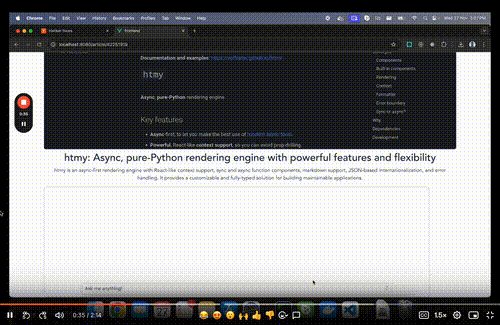

# My Hacker News Chat

RAG application to allow users to chat with Hacker News Articles

## Example

## How it works
Uses OpenAI LLMs and the Haystack framework to orchestrate the workflow of the LLM.

The flow works roughly as follows:
1. Fetch the article
2. Load the article into the LLMs context window
3. Take in the user prompt and generate a response

Visually represented, the pipeline looks like this:

